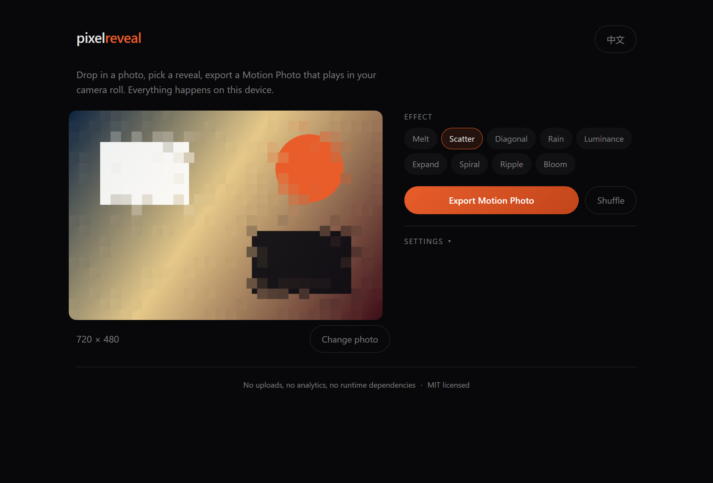

# pixel-reveal

把一张静态照片变成带**像素揭示动画的实况照片（Motion Photo / Live Photo）** —— 全部在浏览器本地完成：不上传、不需要后端、零运行时依赖。



```ts
import { createMotionPhoto } from 'pixel-reveal';

const { blob } = await createMotionPhoto({
  source: file, // File | Blob | ImageBitmap | canvas | ImageData | FrameBuffer
  effect: 'scatter',
  duration: 2.5,
});

// 存成 .jpg，相册就会把它当实况照片处理
download(blob, 'motion-photo.jpg');
```

> English docs: [README.md](./README.md)

---

## 它解决什么

实况照片本质上是「JPEG + 尾部追加的 MP4 + 一段告诉相册『后面有视频』的元数据」。要做出来需要四件事：逐帧渲染、H.264 编码、MP4 封装、容器组装。这个库四件都在本地做完。

- **天然私密** —— 图片不离开设备，没有上传接口，也没有埋点。
- **零运行时依赖** —— MP4 封装库（mp4-muxer 5.2.2）连同其许可证一起内联，打包后约 22 KB（gzip）。
- **可深度自定义** —— 一个效果就是十来行的函数，不需要复杂的插件注册。
- **可测试** —— 渲染层是纯像素运算、不依赖 canvas，因此能在 Node 里跑单元测试。

## 特性

|                  |                                                                                          |
| ---------------- | ---------------------------------------------------------------------------------------- |
| 9 个内置效果     | 像素融化、像素消散、对角渐显、像素雨帘、光影渐现、回字展开、黄金螺旋、水波涟漪、多点绽放 |
| 实时预览 API     | `createPreview()` 只渲染帧不编码，可做拖动预览或循环播放                                 |
| 帧内容可复现     | 相同输入 + 相同参数 = 相同的帧（用带种子的随机数，不用 `Math.random`）                   |
| 编码能力协商     | 自动挑选浏览器真正支持的 H.264 profile/level，并做编码队列背压                           |
| 元数据方案可选   | `google`（默认）、`oplus`、`none`，也可自定义 XMP 属性                                   |
| 已备多语言       | 效果的 label/description 支持 `{ en, zh, … }`，用 `translate()` 解析                     |
| 可在 Worker 里跑 | 渲染层不依赖 DOM                                                                         |

## 安装

尚未发布到 npm，请直接从仓库安装（安装过程中 npm 会自动构建）：

```bash
npm install github:lujianl/pixel-reveal
```

或者从 [最新 Release](https://github.com/lujianl/pixel-reveal/releases/latest) 下载预构建包，直接丢进页面，它会暴露全局 `PixelReveal`：

```html
<script src="pixel-reveal.iife.js"></script>
<script>
  const { createMotionPhoto } = PixelReveal;
</script>
```

也可以克隆后自行构建：

```bash
git clone https://github.com/lujianl/pixel-reveal
cd pixel-reveal && npm install && npm run build
```

## 用法

### 导出实况照片

```ts
import { createMotionPhoto, PixelRevealError } from 'pixel-reveal';

try {
  const result = await createMotionPhoto({
    source: file,
    effect: 'ripple',
    fps: 30,
    duration: 3,
    maxDimension: 2560, // 输出最长边
    blockSize: 32, // 像素块大小；不传则按画幅自动推导
    seed: 7, // 同一个种子 => 同一套随机图案
    cover: 'effect', // 'effect'（动画首帧）| 'original'（原图）
    metadata: { profile: 'google', appName: 'my-app' },
    onProgress: ({ stage, progress, frame, frameCount, etaSeconds }) => {
      console.log(stage, progress, frame, frameCount, etaSeconds);
    },
  });

  console.log(result.width, result.height, result.codec, result.bytes);
  const url = URL.createObjectURL(result.blob);
} catch (error) {
  if (error instanceof PixelRevealError) console.error(error.code, error.message);
}
```

### 实时预览

`createPreview()` 只解码一次并返回帧，可以在正式导出前先做动画或拖动预览。

```ts
import { createPreview, frameToImageData } from 'pixel-reveal';

const preview = await createPreview({ source: file, effect: 'spiral', maxDimension: 720 });
canvas.width = preview.width;
canvas.height = preview.height;

const ctx = canvas.getContext('2d');
for (let i = 0; i <= 30; i++) {
  const frame = preview.render(i / 30);
  ctx.putImageData(frameToImageData(frame), 0, 0);
  await new Promise((r) => requestAnimationFrame(r));
}
```

> 基于块的效果是**累积**的：进度只能递增地渲染。如果要往回拖动，请先调用 `preview.reset()`。

### 写自己的效果

大多数效果只是「每个块一个权重，进度越过权重就点亮该块」：

```ts
import { defineBlockEffect, registerEffect } from 'pixel-reveal';

registerEffect(
  defineBlockEffect({
    name: 'wipe',
    label: { en: 'Wipe', zh: '横向擦除' },
    description: { en: 'Sweeps left to right', zh: '从左向右扫过' },
    duration: 2,
    easing: 'easeOutQuad',
    weights: (ctx) => {
      const weights = new Float32Array(ctx.cols * ctx.rows);
      for (let by = 0; by < ctx.rows; by++) {
        for (let bx = 0; bx < ctx.cols; bx++) {
          weights[by * ctx.cols + bx] = (bx + 1) / ctx.cols; // 需归一化到最大值为 1
        }
      }
      return weights;
    },
  }),
);
```

`weights()` 可以读取 `effectOptions`，所以一个效果能以参数呈现多种形态（`from: 'topLeft'`、`points: 9` 等）。`src/effects/builtin/` 里有九个现成范例。

需要完全掌控时用 `defineEffect()`，直接把像素写进帧缓冲：

```ts
import { defineEffect, frame } from 'pixel-reveal';

registerEffect(
  defineEffect({
    name: 'soft',
    label: 'Soft',
    duration: 2,
    create: (ctx) => (progress, target) => {
      frame.copyInto(target, ctx.sharp);
      frame.blendInto(target, ctx.blur, 1 - progress); // 从模糊中浮现
    },
  }),
);
```

`EffectContext` 提供：`sharp`（输出尺寸的清晰源图）、`blur`（强模糊）、`base`（像素化底图）、块网格（`blockSize` / `cols` / `rows`）、`random()`（带种子）、`getBlurred(radius)`（带缓存）、`reseed()`。

### 参数

| 参数                   | 默认值                  | 说明                                                                                    |
| ---------------------- | ----------------------- | --------------------------------------------------------------------------------------- |
| `source`               | —                       | `File`、`Blob`、`ImageBitmap`、`HTMLImageElement`、canvas、`ImageData` 或 `FrameBuffer` |
| `effect`               | `'square'`              | 内置名称或一个 `EffectDefinition`                                                       |
| `effectOptions`        | `{}`                    | 透传给效果的 `weights()` / `create()`                                                   |
| `duration`             | 效果默认值              | 秒                                                                                      |
| `easing`               | 效果默认值              | 命名曲线或 `(t) => t`                                                                   |
| `fps`                  | `30`                    |                                                                                         |
| `maxDimension`         | `2560`                  | 输出最长边；为 4:2:0 色度采样强制取偶数                                                 |
| `blockSize`            | 自动推导                | 像素块边长（输出像素）                                                                  |
| `seed`                 | `1`                     | 随机类效果的种子                                                                        |
| `cover`                | `'effect'`              | 封面帧：动画首帧，或未处理的原图                                                        |
| `bitrate`              | 自动推导                | 约 0.12 bit/像素/帧，限制在 6–20 Mbps                                                   |
| `hardwareAcceleration` | `'no-preference'`       | 传给编码器的偏好提示                                                                    |
| `metadata`             | `{ profile: 'google' }` | 见下节                                                                                  |
| `codec`                | 浏览器实现              | 可替换为测试用、Worker 用或非浏览器实现                                                 |
| `locale`               | `'en'`                  | 只影响 label 解析                                                                       |
| `signal`               | —                       | `AbortSignal`，可在编码中途取消                                                         |
| `onProgress`           | —                       | 回调 `{ stage, progress, frame, frameCount, etaSeconds }`                               |

返回 `{ blob, type, width, height, frameCount, durationMs, codec, bitrate, hardwareAccelerated, videoBytes, bytes }`。

## 元数据方案（上线前请务必阅读）

实况照片是一个 JPEG，尾部追加 MP4，并写入告诉相册「尾部字节可播放」的元数据：

```
SOI │ APP1(EXIF) │ APP1(XMP) │ APP0 │ APP2(ICC) │ APP2(MPF) │ <图像数据> │ <mp4>
```

| 方案                 | 写入内容                                                                                                                                                                                       |
| -------------------- | ---------------------------------------------------------------------------------------------------------------------------------------------------------------------------------------------- |
| `google`（**默认**） | 通用的 Google 实况照片元数据（`GCamera:MotionPhoto*` + `Container:Directory`）。EXIF 是现场生成的，只含 `Orientation` 与 `ColorSpace`，**不含任何设备标识**。                                  |
| `oplus`              | 额外写入 `OpCamera:*`，并内嵌一段取自**真实 OPPO/一加设备**的 EXIF（包含该设备的指纹信息）。仅在默认方案被某个相册拒绝时才启用，并且要意识到：你分发出去的文件会声称自己来自你并不拥有的硬件。 |
| `none`               | 仍然追加 MP4，但不写容器元数据，多数相册只会显示静态图。                                                                                                                                       |

某台手机是否**播放**这段动画取决于它的相册实现，这不是代码能保证的。请在你在意的机型上实测；`inspectMotionPhoto()` 会给出容器结构自检结果，便于先排除文件本身的问题。

## 确定性说明

同一份构建 + 同一个引擎下保证：

- 只用整数/浮点像素运算，不调用 `Math.random`（随机类效果使用带种子的 PRNG）。
- 相同的 `seed` + `maxDimension` + `blockSize` + `effect` 会产生完全相同的帧。

**不**保证：

- **跨浏览器的逐字节一致**。H.264 编码器由浏览器决定（硬编/软编、profile 支持、色度处理都不同），所以视频码流因设备而异。帧**内容**一致，编码后的字节不一致。若确实需要处处逐字节一致，请替换 `encodeVideo()` 背后的编码器（WASM 或服务端）。
- **`spiral` 使用 `Math.atan2`** 排序。规范未固定其精度，因此引擎之间在角度极接近时的排序可能不同。下游没有任何比特敏感逻辑依赖它。

## 浏览器支持

编码需要 **WebCodecs**（`VideoEncoder` / `VideoFrame`）。它不是 Baseline API —— 可靠目标是 Chrome 94+ / Edge 94+，Firefox 与 Safari 支持较晚或缺失。除最终导出之外的一切（预览、写效果、测试）都不依赖它；`supportsMotionPhotoExport()` 可用于优雅降级。

## 开发

```bash
npm install
npm run dev          # 演示站 http://localhost:5173
npm run typecheck    # tsc --noEmit
npm test             # vitest
npm run build        # 库 -> dist/，演示站 -> dist-demo/
npm run format       # prettier
```

见 [CONTRIBUTING.md](./CONTRIBUTING.md)（如何新增效果）与 [CHANGELOG.md](./CHANGELOG.md)（相对最初零构建版本的行为变更）。

## 许可

[MIT](./LICENSE)。内联的 MP4 封装库同样是 MIT，见 [THIRD-PARTY.md](./THIRD-PARTY.md)。
